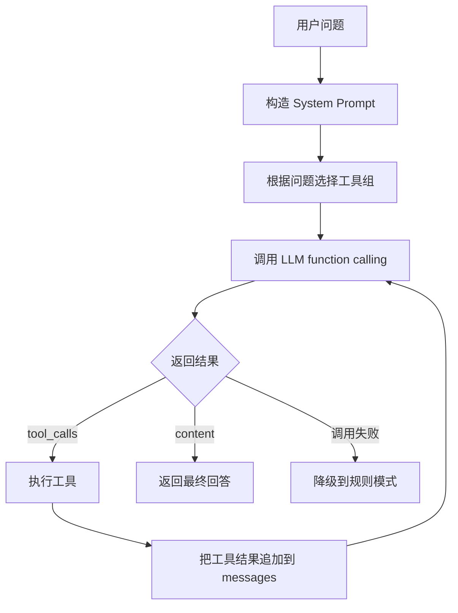

# Agent 开发经验总结

> 面向对象：项目负责人答辩时讲“技术心得”和“开发过程”的材料。

## 1. 核心心得

这个项目最大的技术重点不是“让大模型回答股票问题”，而是“让 Agent 稳定地调度工具”。股票场景对事实准确性要求很高，实时价格、涨跌幅、财务指标不能靠语言模型猜。因此系统采用了“LLM 调度 + 工具取数 + 规则降级”的设计。

可以在答辩中这样概括：

> 我们没有把 LLM 当成万能答案生成器，而是把它放在调度层。它负责理解自然语言和选择工具，真实数据由行情、指标、RAG、模型等工具提供。没有 LLM 时，系统还能退回规则模式，保证核心功能可演示、可测试、可交付。

## 2. 规则模式

规则模式是项目稳定性的基础。实现位置在 `core/agent.py`。

规则模式主要流程：

1. 从用户输入中提取 6 位股票代码。
2. 提取中文关键词，例如“贵州茅台”。
3. 通过关键词判断意图，例如搜索、行情、预测、指标、风险、新闻、知识、综合分析。
4. 按意图调用对应工具或 Skill。
5. 返回结构化中文结果。

规则模式支持约 13 类意图：

- `search`：股票搜索。
- `compare`：多股对比。
- `history`：历史走势。
- `predict`：涨跌预测。
- `indicators`：技术指标。
- `financials`：基本面。
- `news`：新闻舆情。
- `knowledge`：RAG 知识检索。
- `recommend`：选股推荐。
- `risk`：风险评估。
- `preference`：用户偏好。
- `analyze`：综合分析。
- `default`：兜底行情和帮助。

答辩可以强调：规则模式不是低级备用，而是一个确定性基线。它让系统在没有 API Key、网络不稳定或 LLM 响应异常时仍能工作。

## 3. LLM Function Calling

LLM 模式使用 OpenAI-compatible API，不依赖官方 SDK，而是通过 HTTP 请求调用 `/chat/completions`。这样可以兼容 OpenAI、DeepSeek、通义千问、Ollama、vLLM 等服务。

LLM 模式流程：

关键限制：

- 最多 8 轮工具迭代，避免无限循环。
- 每次只处理一个 tool call，让执行链路清晰可控。
- 如果 LLM 调用失败，直接回到规则模式。
- 如果工具失败，把错误说明返回给 LLM 或用户，不编造结果。

## 4. 工具注册

工具系统在 `core/tools.py`。项目没有把工具调用写成散落的 if-else，而是统一注册为 `ToolDef`。

每个工具包含：

- 工具名：给 LLM 调用，例如 `get_stock_info`。
- 描述：告诉 LLM 什么时候该用这个工具。
- 参数 schema：告诉 LLM 参数格式。
- handler：真正执行的 Python 函数。

这样做的好处：

- 新增工具时只需要增加一个 `ToolDef`。
- LLM 和规则模式可以复用同一套工具。
- 工具可以分组，减少 LLM 选择空间。
- 测试时可以直接测试 handler 或工具执行入口。

工具分组经验：

| 分组 | 包含能力 | 适用场景 |
|------|----------|----------|
| `basic` | 搜索、行情、K 线 | 简单查询 |
| `technical` | basic + 指标 + 预测 + 技术分析 | 大多数行情和技术面问题 |
| `full` | 技术、财务、新闻、风险、综合分析、推荐、知识 | 深度分析或复杂请求 |
| `knowledge` | RAG、偏好 | 理论知识和用户设置 |

分组能降低 token 消耗，也能减少 LLM 从太多工具里选错的概率。

## 5. 降级策略

项目里有多层降级。

| 场景 | 降级方式 |
|------|----------|
| 没有 API Key | 使用规则模式 |
| LLM 网络请求失败 | 回退规则模式 |
| TensorFlow 不可用 | 训练和预测使用 sklearn MLP |
| 模型未训练 | 预测工具回退简易均线判断 |
| RAG 依赖或索引不可用 | 返回知识库不可用提示 |
| 新闻或基本面数据源不可用 | 综合报告跳过对应维度 |
| ECharts CDN 不可用 | 前端只提示图表不可用，聊天继续 |
| `/health` 检查 | 只做轻量状态检查，不触发重型加载 |

答辩可以把这部分讲成“工程可靠性设计”：真实项目里外部 API、模型文件、网络、依赖都可能不可用，所以系统不能只写理想路径。

## 6. 防止幻觉

股票分析场景最危险的问题是 LLM 幻觉。项目采用了几种控制方法。

第一，System Prompt 明确约束：

- 禁止编造行情数据。
- 所有价格、涨跌幅、成交量、市盈率、市值、财务指标必须通过工具获取。
- 工具调用失败时，必须说明数据不可用。
- 始终提示不构成投资建议。

第二，LLM 只做调度，不直接拥有行情知识。

系统把实时行情、K 线、技术指标、RAG、模型预测都封装成工具。LLM 即使知道某只股票的常识，也不能直接生成最新行情数字。

第三，综合报告保留降级信息。

例如基本面数据不可用时，`ComprehensiveSkill` 会把该维度标记为不可用，而不是硬凑一段财务分析。

第四，前端不收集 API Key。

LLM 配置通过 `.env` 或环境变量完成，页面只显示指南，不接收、不保存、不上传密钥。这减少了安全风险。

## 7. 可测试性

这个项目能做到 `pytest -q` 通过 69 项测试，关键在于模块边界比较清晰。

可测试性设计：

- Flask 路由和业务逻辑分离，`app.py` 只做请求响应。
- Agent 入口统一为 `agent.run(query, session_id)`。
- 工具通过 `run_tool(name, args)` 统一执行。
- 训练 CLI 的参数解析单独封装为 `build_parser()`。
- RAG 初始化失败会返回 False 或提示，不直接让主流程崩溃。
- `/health` 不加载重型模型，便于快速测试。
- session_id 有校验，避免路径穿越或非法文件名。

测试重点不是证明股票预测准确，而是证明系统行为稳定：

- 输入为空时是否有提示。
- 非法 session_id 是否拒绝。
- RAG 不可用是否优雅降级。
- 模型训练报告接口是否只读。
- `.env` 配置是否按优先级加载。
- 工具和规则路由是否返回合理结果。

## 8. AI 使用与 Harness

由于课程是“人工智能创新实现”，答辩中建议单独讲一页“AI 使用与 Harness”。这里的重点是：项目不是简单把问题转发给大模型，而是把 AI 能力拆成可控的几个层次。

AI 使用层次：

| 层次 | 作用 | 项目实现 |
|------|------|----------|
| LLM Agent | 理解自然语言、选择工具、总结结果 | OpenAI-compatible function calling |
| RAG | 回答投资知识问题，减少自由生成 | Markdown 知识库 + embedding + NumPy 相似度检索 |
| 机器学习模型 | 对历史序列做涨跌二分类实验 | CNN 优先，TensorFlow 不可用时 MLP fallback |
| 规则基线 | 无 API Key 时仍能完成意图识别和工具调度 | 13 类关键词意图分类 |

Harness 可以解释为“AI 功能验收框架”。它不是单个文件，而是一组固定验证手段：

- 固定 6 条演示命令：搜索、行情、技术指标、风险、综合分析、RAG。
- `pytest -q`：当前 69 passed，验证核心路由和边界。
- mock 外部依赖：LLM、行情、RAG、模型报告测试不依赖真实网络。
- `/health`：轻量检查模型、LLM、RAG 状态，不触发重型初始化。
- `git diff --check`：交付前检查格式问题。
- 降级路径测试：LLM 失败回退规则模式，RAG 不可用返回提示，模型未训练有 fallback 或引导。

答辩表达：

> 我们把 AI 能力放进一个 harness 里验证，而不是只做一次演示。这个 harness 覆盖正常路径和失败路径，保证 LLM、RAG、模型和规则基线都能在可控边界内工作。

## 9. Agent 开发中踩过的典型问题

### 9.1 不能让 LLM 直接生成实时数据

早期如果只写“你是股票分析助手”，模型可能会给出看似专业但无法验证的价格和建议。解决方式是把 prompt 改成强约束，并把真实数据获取封装成工具。

### 9.2 工具太多会让模型选择困难

如果一次性把全部工具都给 LLM，模型可能在简单行情问题里调用复杂分析工具。解决方式是按问题选择工具组，例如简单问题只给 basic 或 technical。

### 9.3 演示不能依赖单点外部服务

答辩现场网络、CDN、API Key 都可能出问题。所以系统需要规则模式、模型 fallback、RAG fallback、图表 fallback。

### 9.4 金融预测不能夸大

模型准确率只是实验结果。即使测试集表现超过 baseline，也不能说明未来交易一定有效。项目文档和报告都需要写清楚“不构成投资建议”。

### 9.5 综合报告要处理部分失败

综合分析会调用多个维度。只要一个维度失败就让整个报告失败，用户体验很差。现在的做法是子模块失败时生成 fallback section，其余维度继续输出。

## 10. 答辩可讲的技术亮点

1. 双模式 Agent：LLM 在线模式和规则离线模式共存。
2. Function calling：LLM 负责工具选择，真实数据由工具提供。
3. 工具注册系统：用统一 ToolDef 管理名称、描述、参数和 handler。
4. Skill 技能抽象：把原始工具提升为结构化分析报告。
5. RAG 知识库：用本地 Markdown + 向量检索回答投资知识问题。
6. 模型训练闭环：从 CLI 训练、时间序列切分、模型持久化到前端报告展示。
7. 多层降级策略：没有 LLM、没有 TensorFlow、没有 RAG、数据源失败时仍可运行。
8. 防幻觉设计：禁止 LLM 编造行情数据，所有数值必须来自工具。
9. 可测试工程：69 项 pytest 覆盖核心流程和边界。
10. 安全配置：`.env` 本地加载，真实 API Key 不提交，前端不接收密钥。
11. Harness 化验收：固定演示链路 + 自动化测试 + mock + health check + diff check。

## 11. 6 句答辩表达

可以直接背这几句：

1. “我们的系统不是让大模型直接预测股票，而是让 Agent 调度行情、指标、模型、RAG 等工具。”
2. “LLM 模式负责理解复杂自然语言，规则模式保证没有 API Key 时也能稳定演示。”
3. “所有行情和财务数字都必须来自工具调用，LLM 不能编造实时数据。”
4. “模型训练采用时间序列切分，避免未来信息泄漏；预测结果只作为学习研究参考。”
5. “AI 使用体现在 LLM Agent、RAG、CNN/MLP 模型和规则基线四个层次。”
6. “项目用 harness 验证正常路径和降级路径，所以 AI 功能不是一次性演示，而是可检查、可复现的工程能力。”

## 12. 必须强调的责任边界

本系统用于课程学习、技术展示和研究实验。模型预测、技术指标、新闻舆情、LLM 解读和综合评分都不构成投资建议。股票市场受到政策、宏观经济、公司事件、市场情绪等多因素影响，历史数据模型无法保证未来表现。
