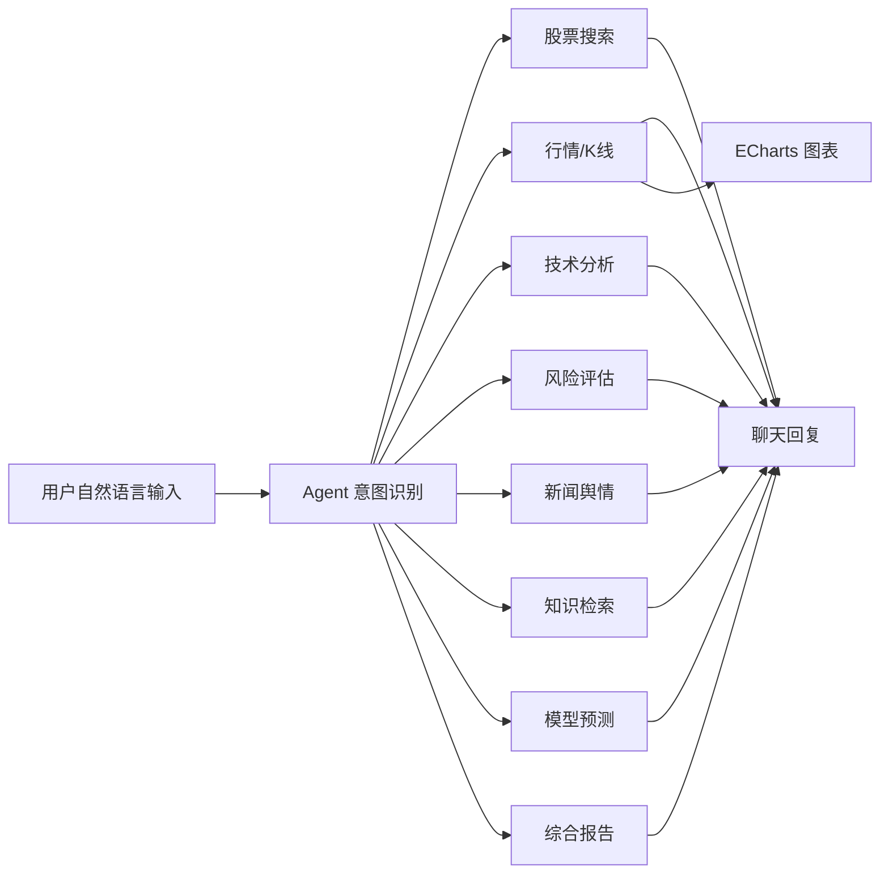
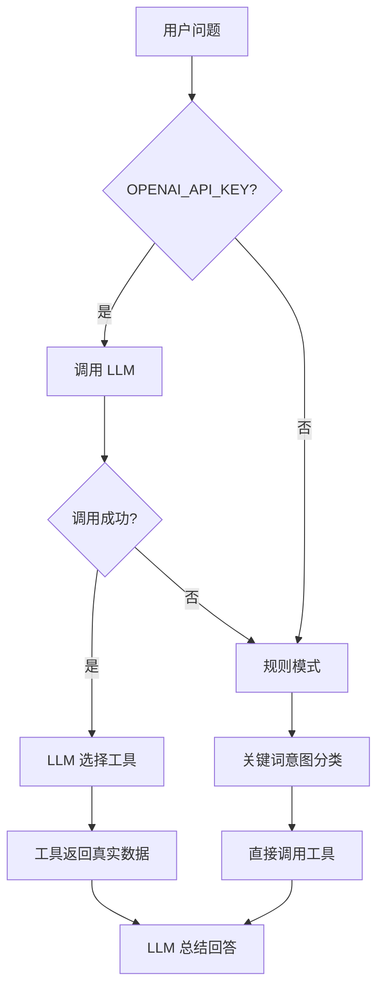

# 期末答辩包装总包

> 目标：把已经完成的 A 股智能分析助手包装成适合期末答辩、PPT 制作和现场演示的材料。

## 1. 需求拆解与产出物

本次“答辩包装”不是继续开发业务功能，而是把项目讲清楚、演示顺、风险边界说明白。

| 需求 | 产出物 | 用途 |
|------|--------|------|
| 给未参与代码的组员详尽项目说明 | `docs/PROJECT_TECHNICAL_EXPLAINER.md` | 制作 PPT、理解模块、准备问答 |
| 给项目负责人 Agent 开发经验总结 | `docs/AGENT_DEVELOPMENT_NOTES.md` | 答辩讲技术心得 |
| 准备 5 分钟演示流程 | 本文第 3 节 | 现场演示按时间推进 |
| 准备 PPT 页面大纲 | 本文第 4 节 | 直接分配给组员做页面 |
| 人工智能创新实现课程说明 | 本文第 4 节、第 6 节 | 单独讲 AI 使用、Agent 设计与验收 harness |
| 准备架构图和流程图素材 | 本文第 5 节 | PPT 可复用 Mermaid 图或重画 |
| 强调预测边界和免责声明 | 本文第 8 节 | 避免夸大股票预测能力 |

## 2. 文档结构方案

三份文档的定位如下：

1. `PROJECT_TECHNICAL_EXPLAINER.md`
   - 面向没看过代码的人。
   - 讲系统是什么、功能有哪些、模块怎么分、数据怎么流动。
   - 覆盖架构、技术栈、核心模块、LLM 在线/离线模式、RAG、模型训练、测试和部署。

2. `AGENT_DEVELOPMENT_NOTES.md`
   - 面向答辩主讲人。
   - 重点讲 Agent 设计：规则模式、LLM function calling、工具注册、降级策略、防止幻觉、可测试性。
   - 适合答辩中回答“你们的智能体现在哪里”“如何保证可靠性”等问题。

3. `MLP_DEFENSE_NOTES.md`
   - 解释 MLP 结构、60日输入、标签、归一化和时间切分。
   - 说明实际训练结果、过拟合、置信度边界和答辩问答。

4. `DEFENSE_PACKAGE.md`
   - 面向整组答辩组织。
   - 包含演示流程、PPT 大纲、图示素材、问答备选和免责声明。

## 3. 5 分钟演示流程

建议演示前确保服务已启动：

```bash
python app.py
```

浏览器打开：

```text
http://127.0.0.1:5000
```

### 0:00 - 0:30 项目开场

讲法：

> 这是一个基于 Flask 和原生前端的 A 股智能分析助手。用户可以用自然语言查询股票行情、技术指标、风险、新闻和综合报告。系统支持 LLM function calling，也支持无 API Key 的规则模式，因此答辩现场即使没有大模型也能稳定运行。

页面操作：

- 打开首页。
- 指一下顶部状态栏：模型、LLM、RAG 状态。
- 如果显示 `LLM离线`，说明当前使用规则模式，这是系统的设计能力。

### 0:30 - 1:10 股票搜索与行情

输入：

```text
搜索 贵州茅台
```

讲法：

> 首先演示股票搜索，系统会调用行情数据模块，根据中文名称匹配股票代码。

接着输入：

```text
查询 600519 行情
```

讲法：

> 这里展示实时行情字段，包括最新价、涨跌幅、市盈率、市净率等。注意这些数字来自工具调用，不是大模型编造。

页面观察：

- 聊天框返回行情。
- 图表区域自动加载 600519 的历史走势。

### 1:10 - 2:00 技术指标与图表

输入：

```text
分析 600519 技术指标
```

讲法：

> 技术分析使用 NumPy 计算 MA、MACD、RSI、BOLL、KDJ 等指标，并通过 TechnicalSkill 组织成带评分和建议的结构化报告。

页面观察：

- 报告中应有多个技术指标。
- ECharts 图表展示收盘价、MA5、MA20 和成交量。

### 2:00 - 2:45 风险评估

输入：

```text
评估 600519 风险
```

讲法：

> 风险评估会从波动率、最大回撤、VaR 等角度分析，不只看涨跌，还关注可能亏损和仓位控制。这也是系统避免单纯荐股的重要设计。

强调：

> 这里的仓位和止损建议是学习研究性质的风险提示，不构成投资建议。

### 2:45 - 3:40 综合分析报告

输入：

```text
综合分析 600519
```

讲法：

> 综合分析由 ComprehensiveSkill 编排多个子技能：技术面、基本面、风险和舆情。部分数据源不可用时，对应章节会显示降级提示，其他章节继续输出。

页面观察：

- 报告章节应包括：【结论】【技术面】【基本面】【风险】【舆情】【操作建议】【免责声明】。

### 3:40 - 4:20 RAG 知识库

输入：

```text
什么是金叉死叉
```

讲法：

> 对投资理论问题，系统不查行情，而是进入 RAG 知识库。知识库来自本地 Markdown 文档，经过分段、向量化和相似度检索后返回相关内容。

如果 RAG 未初始化：

> 如果当前环境没有安装 sentence-transformers，系统会提示知识库不可用。这属于预期降级，不影响主流程。

### 4:20 - 5:00 工程质量收尾

讲法：

> 项目还提供真实日线训练、历史盲测、模型报告和 Docker 部署；测试当前为 pytest -q 87 passed。整体工程重点是：Agent 调度、工具注册、LLM 与规则双模式、RAG、可验证模型实验和多层降级。

最后强调：

> 本系统仅用于课程学习和研究展示，所有分析和预测都不构成投资建议。

## 4. PPT 页面大纲

建议 11 页左右，5 分钟答辩可以压缩讲重点。由于本课程是“人工智能创新实现”，建议单独保留一页讲 AI 使用方式和 harness，而不是只把 AI 藏在技术栈里。

### 第 1 页：项目标题与定位

标题：A 股智能分析助手

内容：

- Flask + 原生前端的股票分析对话系统。
- 支持自然语言查询行情、指标、风险、舆情、知识和综合报告。
- LLM 智能模式 + 规则离线模式。
- 学习研究用途，不构成投资建议。

### 第 2 页：需求背景

内容：

- 普通用户查询股票信息需要在多个网站之间切换。
- 技术指标、风险、新闻、知识解释分散。
- 大模型容易编造实时数据，需要工具约束。
- 因此设计一个“工具驱动”的股票分析 Agent。

### 第 3 页：系统架构图

放本文第 5.1 节架构图。

讲点：

- 前端、Flask、Agent、工具和数据源分层。
- Agent 是调度中心。
- 工具系统连接行情、RAG、模型、新闻、基本面等模块。

### 第 4 页：功能流程图

放本文第 5.2 节流程图。

讲点：

- 用户输入自然语言。
- Agent 判断 LLM 或规则模式。
- 调用工具并生成报告。
- 图表和聊天结果同步展示。

### 第 5 页：技术栈

| 层级 | 技术 |
|------|------|
| 后端 | Flask |
| 前端 | 原生 HTML/CSS/JS，ECharts |
| Agent | LLM function calling，规则意图识别 |
| 数据处理 | pandas，NumPy |
| 模型 | TensorFlow CNN，sklearn MLP fallback |
| RAG | sentence-transformers，NumPy 相似度检索 |
| 数据源 | 腾讯行情 API，AKShare 可选，新闻源 |
| 部署 | Docker，`.env` 配置 |
| 测试 | pytest |

### 第 6 页：核心算法

内容：

- 技术指标：MA、MACD、RSI、BOLL、KDJ、K 线形态。
- 风险指标：波动率、最大回撤、VaR、风险等级。
- RAG：Markdown 分段，embedding，余弦相似度 Top-K 检索。
- 模型预测：60 日滑动窗口，OHLCV 特征，CNN/MLP 二分类。
- 时间序列切分：70% 训练、15% 验证、15% 测试，避免未来泄漏。

### 第 7 页：Agent 与工具调用

内容：

- LLM 模式：function calling + 最多 8 轮工具迭代。
- 规则模式：13 类意图关键词识别。
- 工具注册：`ToolDef(name, description, parameters, handler)`。
- 工具分组：basic、technical、full、knowledge。
- 防幻觉：LLM 不能编造行情，必须调用工具。
### 第 8 页：MLP 模型与历史盲测

内容：

- 输入：目标日前60个交易日 × OHLCV五个特征。
- 结构：300维输入 -> 128神经元 -> 64神经元 -> 涨跌二分类。
- 数据：贵州茅台2775条真实前复权日线。
- 切分：70%训练、15%验证、15%测试，测试区间用于盲测。
- 结果：训练78.26%、验证54.55%、测试47.79%。
- 解读：存在过拟合，盲测用于审计模型，而不是证明可以炒股。
- 交互：用户可独立判断或先查看AI情报，再与MLP和基线比较。
- 隔离：情报只读取目标日前数据，挑战期间普通聊天不能查询股票答案。
- 计分：独立命中2分，使用AI情报命中1分，并统计连胜和分组表现。

讲点：

> 当前答辩实际使用的是 sklearn MLP，不是CNN或LSTM。
> 我们保留并解释低于50%的真实测试结果，重点展示数据隔离和可验证性。
> 大模型在这里不是替用户报答案，而是整理当时可获得的信息，并接受时间隔离约束。

### 第 9 页：AI 使用与 Harness

标题：AI 使用方式与自动化验收 Harness

内容：

- AI 使用不是简单调用 ChatGPT，而是构建股票分析 Agent。
- LLM 用于自然语言理解、工具选择和结果总结。
- RAG 用于投资知识问答，减少自由生成的不确定性。
- 规则模式作为离线 AI 调度基线，保证没有 API Key 时仍可演示。
- Harness 由固定演示命令、pytest、mock 外部依赖、`/health`、训练报告接口和 `git diff --check` 组成。
- 通过 harness 验证：LLM 失败会降级、RAG 不可用会提示、模型不可用会 fallback、外部网络不影响测试。

讲点：

> AI 的创新点不只是“用了大模型”，而是把大模型放在可控的工具调度框架中，并用 harness 验证每条关键链路和失败降级路径。

### 第 10 页：创新点

内容：

- 双模式 Agent：在线智能，离线可用。
- 工具驱动 LLM：让大模型调度工具，而不是凭空生成股票数据。
- Skill 技能系统：把原始工具组合成结构化报告。
- RAG 知识库：支持投资理论问答。
- 多层降级：LLM、RAG、模型、新闻、图表均有 fallback。
- 训练报告可视化入口：模型训练不是黑箱。
- Harness 化验收：固定命令和自动化测试验证 AI 调度链路。
- AI 情报助手：不输出涨跌答案，只整理目标日前信息。
- 盲测双层隔离：聊天入口和工具执行层共同阻断答案旁路。

### 第 11 页：测试与工程质量

内容：

- `pytest -q` 当前结果：87 passed。
- Flask 路由、Agent、工具、RAG 降级、session 校验、配置加载等均有测试。
- Harness 覆盖固定演示链路：搜索、行情、技术指标、风险、综合分析、RAG。
- `.env.example` 提供配置模板，真实 `.env` 不提交。
- Docker 支持轻量部署。
- `/health` 提供模型、LLM、RAG 状态。

### 第 12 页：局限与改进

局限：

- 股票预测只基于历史 OHLCV，无法覆盖宏观、政策、突发新闻。
- 外部行情和新闻 API 受网络影响。
- RAG 知识库规模较小。
- CNN/MLP 是教学实验模型，不代表实盘收益。

改进：

- 引入更多数据源和缓存机制。
- 扩充 RAG 知识库并加入引用来源展示。
- 增加回测模块和更严格的评估指标。
- 增加用户自定义股票池和策略参数。
- 引入更完善的权限、日志和部署监控。

## 5. 图示素材

### 5.1 系统架构图

```mermaid
flowchart TB
    UI[前端 Chat UI<br/>HTML/CSS/JS + ECharts] --> API[Flask API<br/>app.py]
    API --> Agent[StockAgent<br/>core/agent.py]

    Agent --> LLMMode{运行模式}
    LLMMode -->|配置 API Key| LLM[LLM 模式<br/>function calling]
    LLMMode -->|无 Key 或失败| Rule[规则模式<br/>关键词意图识别]

    LLM --> ToolSystem[工具系统<br/>core/tools.py]
    Rule --> ToolSystem

    ToolSystem --> Market[行情与 K 线<br/>market_data.py]
    ToolSystem --> Skills[Skill 报告<br/>technical/risk/news/comprehensive]
    ToolSystem --> RAG[RAG 知识库<br/>rag_service.py]
    ToolSystem --> Model[模型预测<br/>model_service.py]
    ToolSystem --> Memory[会话记忆<br/>memory.py]

    API --> Health[/health]
    API --> Chart[/api/stock/code/history]
    API --> Report[/api/model/report]
```

### 5.2 功能流程图



### 5.3 LLM 与规则双模式图



### 5.4 AI 使用与 Harness 图

```mermaid
flowchart TB
    Course[人工智能创新实现] --> AIUse[AI 使用方式]
    AIUse --> Agent[股票分析 Agent]
    Agent --> LLM[LLM function calling<br/>自然语言理解与工具选择]
    Agent --> Rule[规则意图识别<br/>离线可用基线]
    Agent --> RAG[RAG 知识检索<br/>投资知识问答]
    Agent --> ML[CNN/MLP 模型<br/>涨跌二分类实验]

    Harness[验收 Harness] --> Demo[固定 6 条演示命令]
    Harness --> Tests[pytest 87 passed]
    Harness --> Mock[mock 外部依赖<br/>不依赖真实网络]
    Harness --> Health[/health 状态检查]
    Harness --> Diff[git diff --check]

    Harness --> Agent
```

## 6. 核心算法讲稿

### 技术指标

技术指标模块用 NumPy 计算常见指标，包括移动平均线、MACD、RSI、布林带、KDJ 和 K 线形态。它不是单纯返回数字，而是通过 TechnicalSkill 汇总为技术面评分和文字解释。

### 风险评估

风险模块关注的是“可能亏多少”和“波动有多大”，不是只判断涨跌。它使用波动率、最大回撤、VaR 等指标，给出风险等级和仓位建议。

### RAG

RAG 知识库把本地 Markdown 投资知识切分成文本块，使用 embedding 模型向量化，再用 NumPy 计算相似度。用户问理论问题时，系统检索相关内容，而不是让 LLM 直接自由发挥。

### 模型预测

模型使用 60 日 OHLCV 滑动窗口做涨跌二分类。优先使用 TensorFlow CNN；如果 TensorFlow 不可用，自动使用 sklearn MLP。训练采用时间序列切分，避免未来信息泄漏。

### AI 使用与 Harness

本项目的 AI 使用分成四层：

- LLM Agent：用 function calling 做自然语言理解和工具调度。
- RAG：用向量检索回答投资知识类问题。
- 机器学习模型：用 CNN/MLP 对历史 OHLCV 做涨跌二分类实验。
- 规则 AI 基线：用关键词意图识别保证离线可用。

Harness 的作用是保证 AI 链路可控：

- 固定 6 条核心演示命令，保证答辩现场有稳定主线。
- pytest 使用 mock 测试 LLM、RAG、行情、模型报告等边界，不依赖真实外网。
- `/health` 只做轻量检查，避免探活触发重型初始化。
- `git diff --check` 检查文档和代码格式问题。
- 失败路径也被纳入验收，例如 LLM 失败回退规则模式、RAG 不可用返回提示、模型未训练显示引导。

## 7. 答辩问答准备

### Q1：你们的系统为什么需要 Agent？

因为用户输入是自然语言，背后可能对应搜索、行情、技术指标、新闻、风险、RAG 或综合分析。Agent 负责理解意图并调度工具，使用户不用关心具体 API 和模块。

### Q2：LLM 会不会编造股票数据？

系统设计上不允许。LLM 只负责选择工具和总结，行情、财务、技术指标等数字必须由工具返回。工具失败时系统会提示数据不可用。

### Q3：没有 API Key 还能用吗？

可以。系统会进入规则模式，通过关键词意图识别直接调用工具。这保证了答辩现场和离线环境的稳定性。

### Q4：模型预测准吗？

模型是课程研究性质的二分类实验，只基于历史价格和成交量，不能保证真实市场表现。项目更重视训练流程、时间序列切分、报告展示和风险提示。

### Q5：RAG 的作用是什么？

RAG 用来回答投资知识类问题，例如技术指标含义、风险管理原则等。它能把回答限定在本地知识库内容中，减少自由生成带来的不确定性。

### Q6：工程质量如何保证？

当前 `pytest -q` 为 87 passed，覆盖 Agent、工具、Flask 路由、RAG 降级、session 校验、真实日线训练、盲测 API、聊天隔离、情报缓存和模型资产等核心流程。

### Q7：课程要求人工智能创新，你们的 AI 使用体现在哪里？

体现在四个层面：LLM function calling 负责 Agent 调度，RAG 负责知识检索，CNN/MLP 负责历史序列建模，规则意图识别负责离线基线。我们还用 harness 验证 AI 链路和失败降级，避免只做不可控的大模型聊天。

### Q8：你们说的 harness 是什么？

这里的 harness 指自动化验收框架：固定 6 条演示命令、pytest 测试、mock 外部依赖、`/health` 状态检查、训练报告接口和 `git diff --check`。它的目标是让 AI 功能不只“看起来能跑”，而是每个关键路径和降级路径都能被验证。

## 8. 免责声明表达

PPT 和演示结尾建议保留这段：

> 本系统仅供课程学习、研究和技术展示使用。系统输出的行情分析、技术指标、风险评估、新闻舆情、模型预测和 LLM 解读均不构成投资建议。股票市场存在不确定性，历史数据和模型结果不代表未来收益，投资决策需由用户结合自身风险承受能力独立判断。

## 9. 分工建议

| 角色 | 负责内容 |
|------|----------|
| 组员 A | 根据 `PROJECT_TECHNICAL_EXPLAINER.md` 制作架构、技术栈、功能流程页 |
| 组员 B | 根据本文制作演示流程、PPT 大纲、局限与改进页 |
| 项目负责人 | 根据 `AGENT_DEVELOPMENT_NOTES.md` 讲 Agent 设计、function calling、AI 使用、harness、防幻觉和工程质量 |

## 10. 答辩重点排序

如果时间有限，优先讲：

1. 系统定位：股票分析 Agent，不是简单预测器。
2. 架构：Flask + Agent + 工具系统 + Skills。
3. 双模式：LLM function calling 和规则降级。
4. AI 使用：LLM Agent、RAG、CNN/MLP、规则基线。
5. Harness：固定演示链路、pytest、mock、health、diff check。
6. 特色：综合报告、模型训练闭环、ECharts。
7. 工程质量：87 passed、Docker、`.env`、多层降级。
8. 边界：不构成投资建议。
