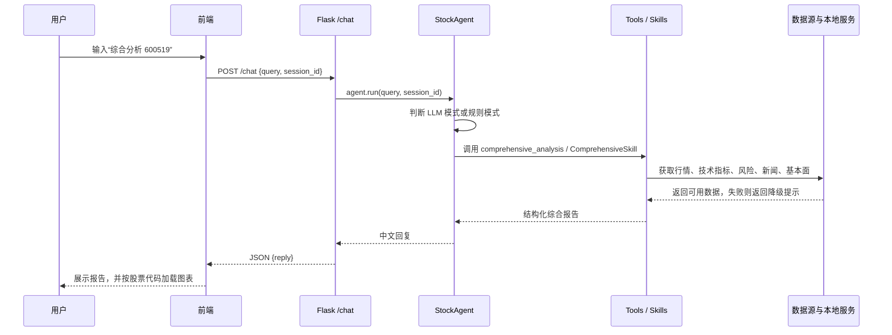

# 项目技术说明文档

> 面向对象：没有参与代码开发、但需要制作 PPT 或参加答辩的组员。
> 项目定位：本系统是一个基于 Flask + 原生前端的 A 股智能分析助手，用自然语言对接行情、技术指标、风险评估、新闻舆情、RAG 知识库、模型预测和综合报告。

## 1. 一句话介绍

股票预测智能分析系统不是单纯的“预测涨跌”程序，而是一个“股票分析 Agent”。用户在网页聊天框输入问题，例如“综合分析 600519”或“什么是金叉死叉”，系统会自动判断意图，调用对应工具，最后返回结构化中文分析。

系统强调三点：

- 可用性：即使没有 LLM API Key，也能用规则模式完成核心功能。
- 可解释性：技术指标、风险、模型训练报告、RAG 检索结果都有明确来源。
- 风险边界：所有分析仅供学习研究，不构成投资建议。

## 2. 已实现功能概览

| 功能 | 用户输入示例 | 背后模块 |
|------|--------------|----------|
| 股票搜索 | `搜索 贵州茅台` | `core/market_data.py` |
| 实时行情 | `查询 600519 行情` | 腾讯行情 API + `core/tools.py` |
| K 线图表 | 输入包含 6 位股票代码 | Flask API + 前端 ECharts |
| 技术指标 | `分析 600519 技术指标` | `core/indicators.py` + `TechnicalSkill` |
| 风险评估 | `评估 600519 风险` | `RiskSkill` |
| 新闻舆情 | `茅台最近有什么新闻` | `core/news.py` + `NewsSkill` |
| 综合报告 | `综合分析 600519` | `ComprehensiveSkill` |
| RAG 知识库 | `什么是金叉死叉` | `core/rag_service.py` |
| 模型预测 | `预测 600519 涨跌` | `core/model_service.py` |
| 模型训练 | `python train_model.py` | 训练 CLI + 训练报告 |
| 用户偏好 | `关注 600519` | `core/memory.py` |
| Docker 部署 | `docker build ...` | `Dockerfile` |
| LLM 配置 | `.env` / 环境变量 | `core/config.py` + `core/llm_service.py` |
| MLP 模型说明 | 模型结构、输入输出与结果解读 | `docs/MLP_DEFENSE_NOTES.md` |

## 3. 系统架构

```mermaid
flowchart TB
    User[用户] --> UI[templates/index.html<br/>原生 HTML/CSS/JS 聊天界面]
    UI --> Flask[app.py<br/>Flask Web/API]
    Flask --> Agent[core/agent.py<br/>对话调度 Agent]

    Agent --> Mode{运行模式}
    Mode -->|有 OPENAI_API_KEY| LLM[LLM 模式<br/>OpenAI-compatible function calling]
    Mode -->|无 API Key 或调用失败| Rule[规则模式<br/>关键词意图识别]

    LLM --> Tools[core/tools.py<br/>工具注册与执行]
    Rule --> Tools

    Tools --> Market[行情/K线<br/>core/market_data.py]
    Tools --> Indicators[技术指标<br/>core/indicators.py]
    Tools --> Skills[Skill 技能系统<br/>core/skills]
    Tools --> Model[模型预测<br/>core/model_service.py]
    Tools --> RAG[RAG 知识库<br/>core/rag_service.py]
    Tools --> Memory[会话记忆<br/>core/memory.py]
    Tools --> News[新闻舆情<br/>core/news.py]
    Tools --> Fundamentals[基本面<br/>core/fundamentals.py]

    Flask --> ChartAPI[/api/stock/code/history]
    ChartAPI --> UIChart[ECharts K线/均线/成交量图]
```

架构可以理解为四层：

1. 前端展示层：聊天界面、状态栏、ECharts 图表、LLM 配置指南。
2. Flask API 层：接收聊天请求、返回历史 K 线、读取模型报告、健康检查。
3. Agent 调度层：判断使用 LLM 模式还是规则模式，并把请求分发给工具。
4. 工具与数据层：行情、指标、模型、RAG、新闻、基本面、用户偏好等模块。

## 4. 请求数据流

以“综合分析 600519”为例：



这个流程体现了项目的核心思想：用户只需要输入自然语言，系统内部负责把问题拆成可执行工具调用。

## 5. LLM 在线模式与规则离线模式

系统有两种运行方式。

| 模式 | 触发条件 | 实现方式 | 优点 |
|------|----------|----------|------|
| LLM 模式 | 已配置 `OPENAI_API_KEY` | `core/llm_service.py` 调用 OpenAI 兼容接口，使用 function calling 选择工具 | 能处理更灵活的自然语言，多轮工具调用能力更强 |
| 规则模式 | 未配置 API Key，或 LLM 调用失败 | `core/agent.py` 用关键词识别 13 类意图，再直接调用工具 | 无需外部大模型，演示稳定，成本低 |

LLM 模式不是让模型凭空回答股票数据，而是让模型“选择工具”。系统 prompt 明确要求：价格、涨跌幅、财务指标等数字必须来自工具调用，无法获取时要说明数据不可用。

规则模式的价值很大：答辩现场即使网络或 API Key 出问题，依然可以演示搜索、行情、技术分析、风险评估、RAG 降级提示等核心链路。

## 6. Agent 调度与工具系统

### 6.1 Agent 的职责

`core/agent.py` 是系统大脑，主要做四件事：

- 判断当前是否进入 LLM 模式。
- 在 LLM 模式下组织 system prompt、工具列表和多轮 function calling。
- 在规则模式下做关键词意图分类。
- 把最终结果写入会话记忆，并返回给前端。

### 6.2 工具注册

`core/tools.py` 使用 `ToolDef` 描述每个工具：

- `name`：工具名，例如 `get_stock_info`。
- `description`：给 LLM 看的能力说明。
- `parameters`：参数 schema。
- `handler`：真正执行的 Python 函数。

工具被分成 `basic`、`technical`、`full`、`knowledge` 等组。Agent 会根据问题先选择工具组，减少 LLM 可选工具数量，提高选择准确率，也节省 token。

### 6.3 Skill 技能系统

`core/skills/` 是更高层的分析能力，不只是返回原始数据，而是生成结构化报告。

| Skill | 功能 | 输出特点 |
|-------|------|----------|
| `TechnicalSkill` | 技术分析 | MA、MACD、RSI、BOLL、KDJ、形态和评分 |
| `FundamentalSkill` | 基本面分析 | PE/PB、ROE、营收、净利润、估值评级 |
| `RiskSkill` | 风险评估 | 波动率、最大回撤、VaR、风险等级、仓位建议 |
| `NewsSkill` | 新闻舆情 | 新闻列表、关键词、情感倾向 |
| `ScreeningSkill` | 选股推荐 | 多策略 Top5 候选 |
| `ComprehensiveSkill` | 综合报告 | 技术面、基本面、风险、舆情四维汇总 |

综合报告不是简单拼接，而是给每个维度加权，最后形成固定章节：【结论】【技术面】【基本面】【风险】【舆情】【操作建议】【免责声明】。

## 7. RAG 知识库

RAG 用于回答投资知识类问题，例如：

- 什么是金叉死叉？
- 如何理解止损？
- 风险管理原则是什么？

实现位置是 `core/rag_service.py`，数据源是 `data/knowledge/*.md`。流程如下：

1. 加载 Markdown 知识文档。
2. 按二级标题和段落切分文本块。
3. 使用 `sentence-transformers` 生成向量。
4. 用 NumPy 点积做余弦相似度检索。
5. 返回相关片段和相似度。

如果没有安装 `sentence-transformers` 或索引不可用，系统会返回“知识库尚未初始化或当前不可用”的提示，而不是影响整个聊天系统。

## 8. 模型训练与预测

模型相关代码在 `core/model_service.py` 和 `train_model.py`。

### 8.1 输入数据

训练数据来自 CSV，核心字段包括：

- `open`：开盘价
- `high`：最高价
- `low`：最低价
- `close`：收盘价
- `vol`：成交量
- `label`：涨跌标签

模型使用 60 个交易日作为一个滑动窗口，预测下一阶段涨跌方向。

### 8.2 训练策略

项目使用时间序列切分，而不是随机打乱：

```text
前 70%：训练集
中 15%：验证集
后 15%：测试集
```

这样做是为了避免未来数据泄漏。股票时间序列不能像普通分类任务一样随意打乱，否则训练集可能看到未来信息，测试结果会虚高。

### 8.3 模型后端

| 后端 | 条件 | 说明 |
|------|------|------|
| TensorFlow CNN | 已安装 TensorFlow | 使用 Conv1D 提取时间序列局部模式 |
| sklearn MLP | TensorFlow 不可用 | 自动降级为多层感知机，便于轻量演示 |

当前贵州茅台历史盲测明确使用 sklearn MLP：60日 × 5个OHLCV特征被展开为300维输入，经过128和64神经元的两个隐藏层，输出上涨/下跌类别。完整答辩说明见
[`MLP_DEFENSE_NOTES.md`](MLP_DEFENSE_NOTES.md)。

训练完成后生成：

- `models/stock_cnn.keras` 或 `models/stock_mlp.joblib`
- `models/scaler.json`
- `models/meta.json`
- `models/training_report.json`

训练报告会展示训练集、验证集、测试集准确率和 baseline accuracy。答辩时要强调：该模型只是教学研究性质的涨跌二分类实验，不保证真实收益。

## 9. 前端与图表

前端位于 `templates/index.html`，使用原生 HTML/CSS/JS，没有引入大型前端框架。核心能力：

- 聊天消息流。
- 输入问题并调用 `/chat`。
- 顶部展示服务状态，例如模型是否加载、LLM 是否在线、RAG 是否就绪。
- 输入中出现 6 位股票代码时，调用 `/api/stock/<code>/history` 加载历史数据。
- 使用 ECharts 展示收盘价、MA5、MA20 和成交量。
- 提供 LLM 配置指南，但不收集、不保存 API Key。

图表依赖 CDN。如果 ECharts 加载失败，页面只显示图表降级提示，不影响聊天功能。

## 10. API 路由

| 方法 | 路径 | 功能 |
|------|------|------|
| GET | `/` | 返回前端页面 |
| POST | `/chat` | 对话入口 |
| GET | `/memory` | 读取用户偏好 |
| POST | `/memory` | 更新用户偏好 |
| GET | `/health` | 健康检查 |
| GET | `/api/stock/<code>/history` | 返回历史 K 线，供图表使用 |
| GET | `/api/model/report` | 返回训练报告 |

`/health` 是轻量接口，不会加载重型 RAG 模型，只检查状态，适合前端状态栏和部署探活。

## 11. 部署与配置

### 11.1 本地启动

```bash
pip install -r requirements.txt
python app.py
```

默认访问地址是 `http://127.0.0.1:5000`。

### 11.2 可选依赖

```bash
pip install -r requirements-optional.txt
```

可选依赖包括：

- `tensorflow`：启用 CNN。
- `akshare`：启用更多基本面或股票池数据。
- `sentence-transformers`：启用 RAG 向量检索。

### 11.3 LLM 配置

可以复制 `.env.example` 为 `.env`，填入：

```text
OPENAI_API_KEY=sk-your-key
OPENAI_BASE_URL=https://api.deepseek.com/v1
OPENAI_MODEL=deepseek-chat
```

`.env` 已被忽略，不应提交真实 API Key。

### 11.4 Docker 部署

```bash
docker build -t stock-prediction-system .
docker run --rm -p 5000:5000 stock-prediction-system
```

Docker 镜像默认只包含轻量基础依赖，不包含 TensorFlow 等重依赖。

## 12. 测试与工程质量

当前测试状态：`pytest -q` 为 `81 passed`。

测试覆盖重点包括：

- Agent 规则模式意图分发。
- 核心工具行为。
- 模型训练参数解析和报告。
- RAG 不可用时的降级提示。
- session_id 校验和记忆安全。
- `.env` 加载逻辑。
- Flask 路由基础行为。

工程质量亮点：

- 双模式设计提升演示稳定性。
- 工具注册统一，便于扩展。
- 大模型只负责调度，不负责编造行情数字。
- 多处使用降级策略，避免单个数据源失败导致系统整体不可用。
- 训练采用时间序列切分，避免未来信息泄漏。

## 13. 答辩时必须讲清楚的边界

本系统不能承诺预测股票一定准确，也不构成投资建议。模型预测只基于历史价格和成交量特征，不包含宏观经济、突发新闻、政策变化、市场情绪等重要因素。

更准确的表述是：

- 这是一个教学研究型智能分析助手。
- 预测结果是辅助参考，不是买卖信号。
- 综合报告用于展示数据整合、Agent 调度和工程实现能力。
- 所有投资决策应由用户独立判断，并结合风险承受能力。
